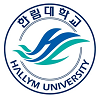

이력서
==========
  
> 이름 : **황석주**    
  
  
  
> 학교 : 한림대학교  
  

Link:
[Hallym][1]

[1]: https://www.hallym.ac.kr/ "Hallym"  
<https://www.hallym.ac.kr/>
   
  
> 학과 : 융합소프트웨어(빅데이터)  
   
  

------------------------------
  
#### 수강과목
* 오픈소스리눅스 실무  
* 머신러닝
* 빅데이터 응용
* 텍스트정보처리
* 데이터베이스
* 오디세이세미나
  
------------------------------
  
취미 : 음악 듣기.

특기 : 코딩 최적화를 잘 합니다.

------------------------------
  
관심 분야 :   
데이터베이스 분야에 관심이 있습니다.  
데이터를 관리하고, 그 데이터를 분석하는 것에 흥미가 있습니다.  

